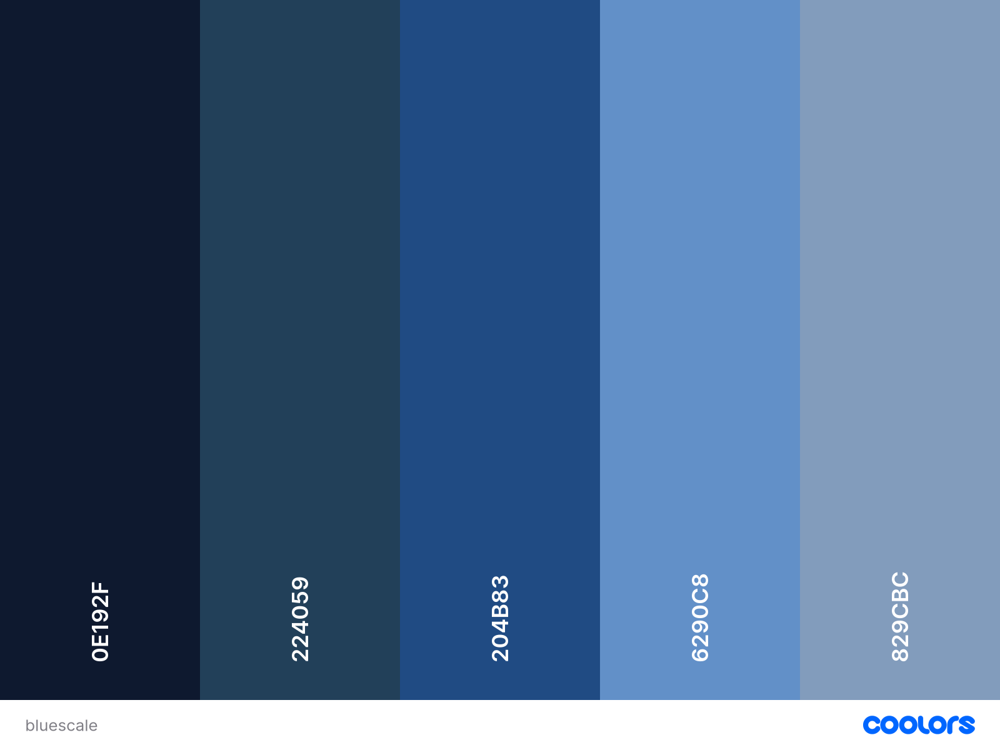

## Wireframe Assessment - Portfolio Design

### Moodboarding and Colour Scheme
___
#### Colour Scheme
I want this portfolio page to be cohesive in its design, and also for the colour scheme to have some longevity. For this I would use a Monochrome or Analogous theme with bold colours only being used for emphasis and animations.  
Will stick to blues, purples and deep reds and reconsider as I go. Would like to use a gradient background for the main section from a slightly saturated blue to a desaturated grey blue.
Colours as below:
- Font Colours
    - Light to contrast dark background colours, dark to contrast light backgrounds
    - All sticking to theme colour pallette
- Header 
    - Darkest shade of chosen colour
    - Nav buttons to be light tint of chosen theme colour w/ dark shadow to pop
- Main
    - Background: Muted version of theme colour, gradient to grey in bottom right corner
    - Cards: Darker shade of chosen colour w neon glow border
- Footer
    - same colour as header to create clean and cohesive look

### Moodboarding

##### Colour Palette Options

### Pages and Sections
___
#### Header, Footer and Navbar
Header is simple clean design static formatting for all subpages:
- Logo/Profile Picture top left image
- Social Media/Contact buttons (circular icon style)
- Nav bar 
    - 4x clickable anchor link buttons
        - Home
        - Projects
        - Work History
        - Contact  

Footer contains copyright information, as well as direct contact info (email mailto link)

#### Home page (index.html) 
 All information listed below is in the "MAIN" section of each page
Main
Landing page with "about me" section, including basic personal information, hobbies and interests.  
Will use static elements and containers including large profile image. 
Animation can go here: 
- fade in for "about" section 
- Grayscale colour fade in for large photo

#### Projects
Flexbox and Card divs for projects with the following in each:
- Image Thumb - code snippet for each project
- Project Title - Title 
- Description of project and skills/languages used
Can link to all repos on GitHub directly through clickable image thumb.

Ideally use shadow and/or neon effect to add emphasis to each, with hover psuedoclass.  
Ideas for unique hover animations:
- Neon colour change effect on hover
- Scale increase on hover
- Grayscale all other cards on hover? 
	- This one would be a challenge as we haven't really covered this on any lessons, would look cool though to emphasise the one card!

#### Work History
See above, with additional details below:

Link to file on html page - Resume.PDF  
Any external links to websites as needed!

### Mobile Device Responsive Design
Max Screen width 600  
No hover animations for any sections  
re-display card content as single column

### Tablet Device Responsive Design
max screen width 820  
No hover animations for any sections  

## References: 
|Concept|Websites Used| Used for |
|:---:|:---:|:-----:|
|Device Pixel Sizes|https://www.browserstack.com/guide/ideal-screen-sizes-for-responsive-design | Used to correctly represent screen size in wireframe for iPad, iPhone|
|Colour Theory| https://codehalweb.com/complete-responsive-personal-portfolio-website/ | Used reference image as part of Moodboarding